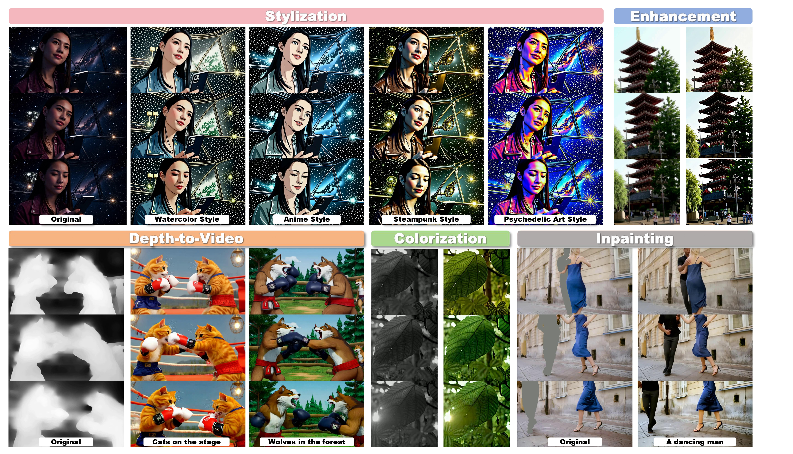

# SVEET: Streaming Video Editing with Easy Adaptation
<br>

<a href="https://arxiv.org/abs/2506.04158"></a>
<a href="https://huggingface.co/Cicici1109/SVEET"></a>


> **Streaming Video Editing with Easy Adaptation**
> <br>
> Yujia Hu, 
> Jiajun Li,
> Zihao He
> and
> [Songhua Liu](https://huage001.github.io)
> <br>
> Shanghai Jiao Tong University
> <br>



Official implementation of **SVEET**, a framework that learns video editing on a bidirectional
Wan2.1-VACE backbone and transfers the learned control branch to a causal streaming backbone.

This repository supports two core workflows:

- **Fast Inference**: Directly use our released SVEET LoRA without any training\.

- **Training \& Reproduction**: Estimate feature matrix `W`, construct projection matrix `Pi_perp`, and customize training for new video editing tasks\.

## Repository layout

```Plain Text
SVEET-release/
├── DiffSynth-Studio-vaceori/     # VACE training and offline LoRA merging
├── Self-Forcing/                 # Causal streaming inference pipeline
├── tools/
│   ├── export_causal_checkpoint.py  # Export single-file causal generator weights
│   ├── feature_map.py              # Estimate feature matrix W
│   └── feature_or.py               # Construct projection matrix Pi_perp
├── data/dataset_example.csv      # Dataset format template
├── assets/                       # Teaser and visual assets
├── requirements.txt
└── THIRD_PARTY.md
```

## Installation

Python 3.10, Linux, CUDA-capable NVIDIA GPUs, and a recent CUDA toolkit are recommended.
Install the remaining dependencies:

```bash
conda create -n sveet python=3.10 -y
conda activate sveet

# Example only. Select the PyTorch command matching your CUDA driver.
pip install torch torchvision --index-url https://download.pytorch.org/whl/cu128
pip install -r requirements.txt
pip install -e ./DiffSynth-Studio
pip install -e ./Self-Forcing
```

## Checkpoints

Download all required pretrained checkpoints below\. The `merged` folder is generated locally and **does not need manual download**\.

```Plain Text
checkpoints/
├── bidirectional/Wan-AI/Wan2.1-VACE-1.3B/  # Base VACE model (required)
├── sveet-control/style.safetensors         # Released SVEET LoRA (required)
├── chunkwise/causal_forcing.pt             # Causal Forcing generator (required)
└── merged/Wan2.1-VACE-1.3B/                # Auto-generated LoRA-merged model
```

Run all download commands sequentially to get full inference weights:

```Plain Text
# 1. Download Wan2.1-VACE base model
hf download Wan-AI/Wan2.1-VACE-1.3B --local-dir checkpoints/bidirectional/Wan-AI/Wan2.1-VACE-1.3B

# 2. Download released SVEET LoRA
hf download Cicici1109/SVEET style.safetensors --local-dir checkpoints/sveet-control

# 3. Download Causal Forcing checkpoint
hf download zhuhz22/Causal-Forcing chunkwise/causal_forcing.pt --local-dir checkpoints
```

# Inference with the released SVEET checkpoint

Merge the LoRA weight into the full VACE model for inference:

```Plain Text
python DiffSynth-Studio-vaceori/merge_lora.py \
  --base_model_dir checkpoints/bidirectional/Wan-AI/Wan2.1-VACE-1.3B \
  --lora_path checkpoints/sveet-control/style.safetensors \
  --output_model_dir checkpoints/merged/Wan2.1-VACE-1.3B \
  --alpha 1.0 \
  --assets_mode symlink
```


```Plain Text
cd Self-Forcing
python infer_single.py \
  --input_video /path/to/source.mp4 \
  --prompt "Make it a Japanese anime style, cel shading." \
  --model_dir ../checkpoints/merged/Wan2.1-VACE-1.3B \
  --checkpoint_path ../checkpoints/chunkwise/causal_forcing.pt \
  --config_path configs/causal_forcing_dmd_chunkwise.yaml \
  --output_dir outputs \
  --num_output_frames 21 \
  --seed 123
```

# Training and method reproduction

This section is **optional** for inference users\. Follow these steps to reproduce our training pipeline and customize new editing LoRAs\.

Download the Wan2.1-T2V base model for feature matrix estimation:

```Plain Text
hf download Wan-AI/Wan2.1-T2V-1.3B --local-dir checkpoints/bidirectional/Wan-AI/Wan2.1-T2V-1.3B
```

Convert the chunked causal checkpoint to a standalone safetensors file:

```Plain Text
python tools/export_causal_checkpoint.py \
  --base_model_dir checkpoints/bidirectional/Wan-AI/Wan2.1-T2V-1.3B \
  --checkpoint_path checkpoints/chunkwise/causal_forcing.pt \
  --state_key generator \
  --output_dir checkpoints/causal/Wan-AI/Wan2.1-T2V-1.3B
```

Estimate feature maps W:

```Plain Text
PYTHONPATH=DiffSynth-Studio-vaceori python tools/feature_map.py \
  --dataset_csv data/dataset_example.csv \
  --dataset_root /path/to/dataset \
  --video_column vace_video \
  --model_root checkpoints/bidirectional \
  --causal_model_root checkpoints/causal \
  --bidirectional_model_id Wan-AI/Wan2.1-T2V-1.3B \
  --causal_model_id Wan-AI/Wan2.1-T2V-1.3B \
  --num_train 500 \
  --num_holdout 20 \
  --ridge 1e-3 \
  --output artifacts/W_matrices.pt
```

Construct Pi_perp:

```Plain Text
python tools/feature_or.py \
  --w_path artifacts/W_matrices.pt \
  --energy_threshold 0.8 \
  --save_path artifacts/pi_perp_0.8.pt
```

Train the control branch:

```Plain Text
cd DiffSynth-Studio-vaceori
accelerate launch examples/wanvideo/model_training/train.py \
  --dataset_base_path /path/to/dataset \
  --dataset_metadata_path ../data/dataset_example.csv \
  --data_file_keys "video,vace_video" \
  --height 480 --width 832 \
  --dataset_repeat 1 \
  --model_id_with_origin_paths "Wan-AI/Wan2.1-VACE-1.3B:diffusion_pytorch_model*.safetensors,Wan-AI/Wan2.1-VACE-1.3B:models_t5_umt5-xxl-enc-bf16.pth,Wan-AI/Wan2.1-VACE-1.3B:Wan2.1_VAE.pth" \
  --pi_perp_path ../artifacts/pi_perp_0.8.pt \
  --learning_rate 1e-4 --weight_decay 1e-2 \
  --save_steps 1000 --num_epochs 10 \
  --remove_prefix_in_ckpt "pipe.vace." \
  --output_path ../checkpoints/sveet-control \
  --lora_base_model vace \
  --lora_target_modules "q,k,v,o,ffn.0,ffn.2" \
  --lora_rank 128 \
  --extra_inputs vace_video \
  --use_gradient_checkpointing_offload
```

## Acknowledgements and licenses

This project builds on [DiffSynth\-Studio](https://github.com/modelscope/DiffSynth-Studio), [Wan2.1-VACE](https://huggingface.co/Wan-AI/Wan2.1-VACE-1.3B) and [Causal Forcing](https://github.com/thu-ml/Causal-Forcing)\. Please refer to [THIRD_PARTY.md](https://www.doubao.cn) for detailed license terms before redistribution\.

## Citation

```
TODO
```
